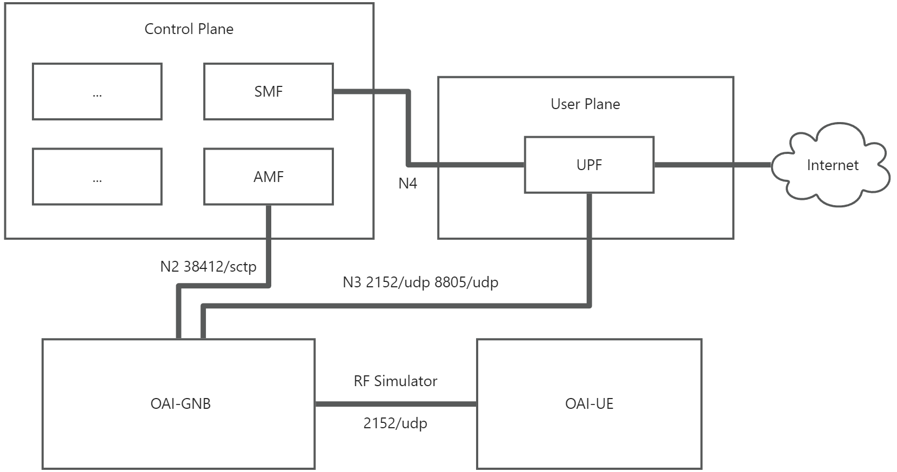

# 说明

核心网采用 Open5gs 构建，并将控制面和用户面分离。

采用 oai 的 gnb 和 ue 来模拟整个网络流程，并使用了 rf simulator，不需要 USRP 介入。

# 架构

整个系统采用 docker 分布式部署各个组件功能，分为四部分（四个服务器）：

- Control Plane (10.112.8.44)：核心网控制面
- User Plane (10.112.54.59)：核心网用户面
- OAI GNB (10.112.140.18)：5G 基站
- OAI UE （10.112.130.180）：用户终端

